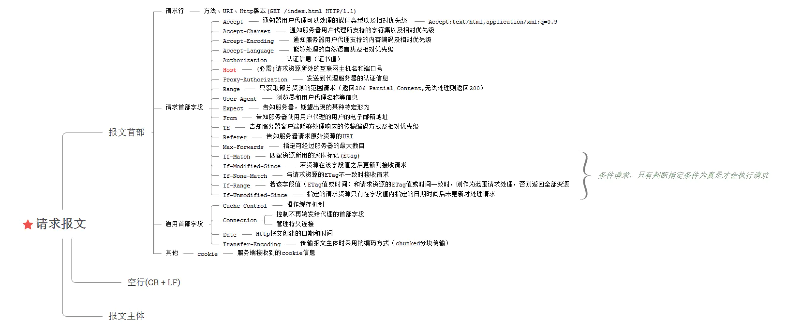
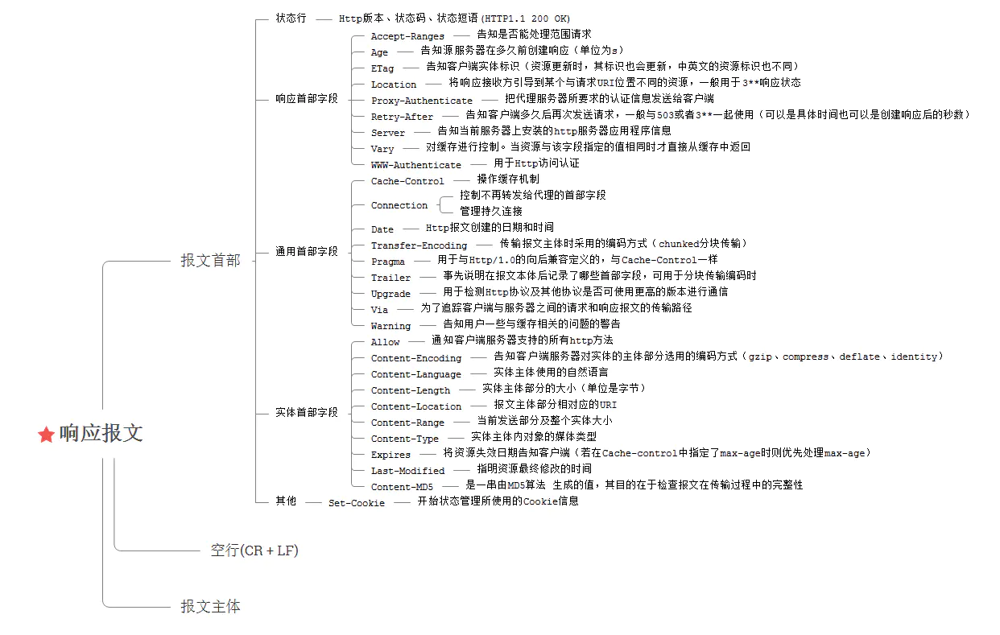

# 当你输入 URL 按下 enter 会发生什么

### 1. DNS域名解析

- 在浏览器DNS缓存中搜索
- 在操作系统DNS缓存中搜索
- 读取系统hosts文件，查找其中是否有对应的ip
- 向本地配置的首选DNS服务器发起域名解析请求

### 2. 建立TCP连接

为了准确地传输数据，TCP协议采用了三次握手策略。发送端首先发送一个带SYN（synchronize）标志的数据包给接收方，接收方收到后，回传一个带有SYN/ACK(acknowledegment)标志的数据包以示传达确认信息。最后发送方再回传一个带ACK标志的数据包，代表握手结束。在这过程中若出现问题中断，TCP会再次发送相同的数据包。

TCP是一个端到端的可靠的面向连接的协议，所以HTTP基于传输层TCP协议不用担心数据的传输的各种问题。

### 3. 发起HTTP请求

请求方法：

- GET:获取资源
- POST:传输实体主体
- HEAD:获取报文首部
- PUT:传输文件
- DELETE:删除文件
- OPTIONS:询问支持的方法
- TRACE:追踪路径

请求报文：

请求报文

### 4. 接受响应结果

状态码：

- 1**：信息性状态码
- 2**：成功状态码
   200：OK 请求正常处理
   204：No Content请求处理成功，但没有资源可返回
   206：Partial Content对资源的某一部分的请求
- 3**：重定向状态码
   301：Moved Permanently 永久重定向
   302：Found 临时性重定向
   304：Not Modified 缓存中读取
- 4**：客户端错误状态码
   400：Bad Request 请求报文中存在语法错误
   401：Unauthorized需要有通过Http认证的认证信息
   403：Forbidden访问被拒绝
   404：Not Found无法找到请求资源
- 5**：服务器错误状态码
   500：Internal Server Error 服务器端在执行时发生错误
   503：Service Unavailable 服务器处于超负载或者正在进行停机维护

响应报文：

响应报文

### 5. 浏览器解析html

浏览器按顺序解析html文件，构建DOM树，在解析到外部的css和js文件时，向服务器发起请求下载资源，若是下载css文件，则解析器会在下载的同时继续解析后面的html来构建DOM树，则在下载js文件和执行它时，解析器会停止对html的解析。这便出现了js阻塞问题。
 **预加载器**：
 当浏览器被脚本文件阻塞时，预加载器（一个轻量级的解析器）会继续解析后面的html，寻找需要下载的资源。如果发现有需要下载的资源，预加载器在开始接收这些资源。预加载器只能检索HTML标签中的URL，无法检测到使用脚本添加的URL，这些资源要等脚本代码执行时才会获取。
 注: 预解析并不改变Dom树，它将这个工作留给主解析过程

浏览器解析css，形成CSSOM树，当DOM树构建完成后，浏览器引擎通过DOM树和CSSOM树构造出渲染树。渲染树中包含可视节点的样式信息（不可见节点将不会被添加到渲染树中，如：head元素和display值为none的元素）

> 值得注意的是，这个过程是逐步完成的，为了更好的用户体验，渲染引擎将会尽可能早的将内容呈现到屏幕上，并不会等到所有的html都解析完成之后再去构建和布局render树。它是解析完一部分内容就显示一部分内容，同时，可能还在通过网络下载其余内容。

### 6. 浏览器布局渲染

- 布局：通过计算得到每个渲染对象在可视区域中的具体位置信息（大小和位置），这是一个递归的过程。
- 绘制：将计算好的每个像素点信息绘制在屏幕上

在页面显示的过程中会多次进行Reflow和Repaint操作，而Reflow的成本比Repaint的成本高得多的多。因为Repaint只是将某个部分进行重新绘制而不用改变页面的布局，如：改变了某个元素的背景颜色。而如果将元素的display属性由block改为none则需要Reflow。

减少rpaint和reflow 方法

参考链接：
 [一次完整的HTTP事务是怎样一个过程？](https://link.jianshu.com?t=http://www.linux178.com/web/httprequest.html)
 [浏览器内部工作原理](https://link.jianshu.com?t=http://kb.cnblogs.com/page/129756/)
 [浏览器的渲染原理简介](https://link.jianshu.com?t=http://coolshell.cn/articles/9666.html)
 [渲染树构建、布局及绘制](https://link.jianshu.com?t=https://developers.google.com/web/fundamentals/performance/critical-rendering-path/render-tree-construction?hl=zh-cn)
 [如何通过预加载器提升网页加载速度](https://link.jianshu.com?t=http://www.admin10000.com/document/3724.html)
 [了解html页面的渲染过程](https://link.jianshu.com?t=http://www.cnblogs.com/yuezk/archive/2013/01/11/2855698.html)
